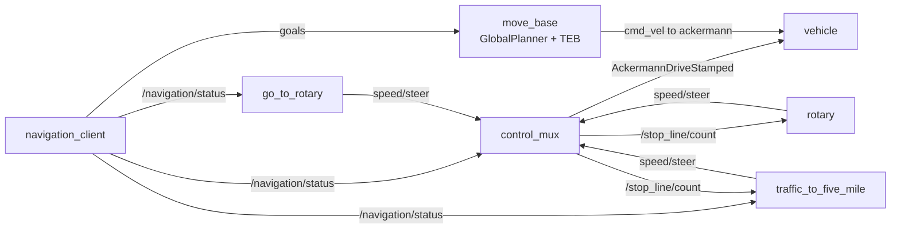

# 2025 Virtual Environment Autonomous Driving Competition

ROS Noetic code our team ran in the **2025 Virtual Environment Autonomous Driving Competition** (hosted by Kookmin University, August 14, 2025).
A small car-like vehicle (wheelbase 0.26 m) drives the course in the MORAI simulator (the code uses `morai_msgs`). The run starts with a map-based navigation section, followed by lane keeping with obstacles, a roundabout, and a traffic-light intersection.

## My part: SLAM-based navigation

I was responsible for the SLAM and navigation section, the first part of every run. The vehicle drives through four map-frame waypoints, and when it reaches the last one, the rest of the mission stack takes over.

| File | What it does |
| --- | --- |
| [`wego/scripts/navigation_client.py`](wego/scripts/navigation_client.py) | Sends four waypoints to `move_base` through `actionlib`. Arrival is judged from the action result (`SUCCEEDED`), not from a coordinate range. Goals that end `ABORTED`, `REJECTED` or `PREEMPTED` are sent again instead of stopping the run. After the last goal it publishes `1` on `/navigation/status`, which every other node waits for. |
| [`wego_2d_nav/launch/move_base.launch`](wego_2d_nav/launch/move_base.launch) | `move_base` with `GlobalPlanner` (Dijkstra) and the TEB local planner, using EKF-filtered odometry (`/odometry/filtered`). |
| [`wego_2d_nav/params/`](wego_2d_nav/params) | Costmaps (static, voxel obstacle and inflation layers) and TEB parameters for a car-like robot: polygon footprint, 0.755 m minimum turning radius, 0.2 m goal tolerance. |

`/navigation/status` is the handoff interface between my section and the rest of the stack. Until it turns to `1`, stop lines are not counted, the lane-keeping and traffic-light nodes ignore their sensor input, and `control_mux` publishes no commands.

## How the mission stack fits together



| Section | Starts when | Node in control |
| --- | --- | --- |
| Map-based navigation (4 waypoints) | Run starts | `move_base`, driven by `navigation_client` |
| Lane keeping with static and moving obstacles | `/navigation/status` = 1 | `go_to_rotary` |
| Roundabout | 5th stop line | `rotary` |
| Traffic light and final section | 6th stop line | `traffic_to_five_mile` |

Team modules in `wego/scripts/`:

- **`control_mux.py`** counts stop lines (`stop_line_detect.py`: white mask, bird's-eye warp, pixel count in an ROI) and picks which node controls the car. It converts the selected speed and steering commands into `AckermannDriveStamped` at 60 Hz.
- **`go_to_rotary.py`** keeps the lane with HSV masks, a perspective warp, sliding windows and PID steering. With LiDAR, it tells static from moving obstacles by how far the obstacle's center shifts within 0.2 s: it stops for moving ones and changes lanes around static ones. It enters the roundabout when the `map → base_link` transform reaches a fixed waypoint.
- **`rotary.py`** runs a state machine: wait for the 5th stop line, stop and observe (LiDAR checks the gap ahead and picks the inner or outer lane), enter, exit when the right lane marking disappears, and cruise. It uses `lane_follower.py` for lane keeping.
- **`traffic_to_five_mile.py`** waits for a left-turn signal from the simulator, makes a timed left turn, follows the yellow line with a curvature-dependent offset, and handles later stop lines with a right turn, an IMU heading hold for straight driving, and the end of the run at the fourth.

## Repository layout

```text
├── wego/
│   ├── CMakeLists.txt, package.xml
│   ├── launch/mission.launch          # starts all mission nodes
│   ├── scripts/                       # navigation client, mux, mission nodes, odom TF
│   └── src/convert_lidar.cpp          # LiDAR scan reordering
└── wego_2d_nav/
    ├── CMakeLists.txt, package.xml
    ├── launch/move_base.launch        # navigation stack
    ├── params/                        # costmap and TEB parameters
    └── scripts/cmd_vel_to_ackermann.py
```

## What is not included

Both packages now have their `package.xml` and `CMakeLists.txt`, but the repository is still not a complete workspace. These parts are missing:

- The course map, and the SLAM and localization launch files
- The MORAI simulator and its ROS bridge

To run it, place both packages in a catkin workspace that provides these, then:

```bash
roslaunch wego_2d_nav move_base.launch   # plus map server and localization from that workspace
roslaunch wego mission.launch
```

## Known limitations

- Most constants are hand-tuned for the competition map: HSV thresholds, open-loop turn timings and waypoint coordinates.
- Section switching depends on counting stop lines. One missed or double-counted stop line shifts every later section.
- `go_to_rotary.py` uses `np.int`, which NumPy 1.24 removed. The code ran on ROS Noetic's default NumPy and needs `int` on newer versions.

## Acknowledgements

The workspace layout and the navigation setup started from the open repository of team Sparkle from an earlier competition: [hyunjoon0208/Sparkle](https://github.com/hyunjoon0208/Sparkle). These files are copied from it unchanged:

| File | Role |
| --- | --- |
| `wego/package.xml`, `wego_2d_nav/package.xml`, `wego_2d_nav/CMakeLists.txt` | Package definitions |
| `wego/scripts/pub_odom.py` | Broadcasts the `odom` TF from `/odom` |
| `wego/src/convert_lidar.cpp` | Reorders the simulator's `lidar2D` scan and republishes it as `/scan` |
| `wego_2d_nav/scripts/cmd_vel_to_ackermann.py` | Converts `move_base` velocity commands into Ackermann commands |
